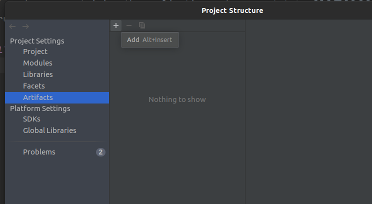
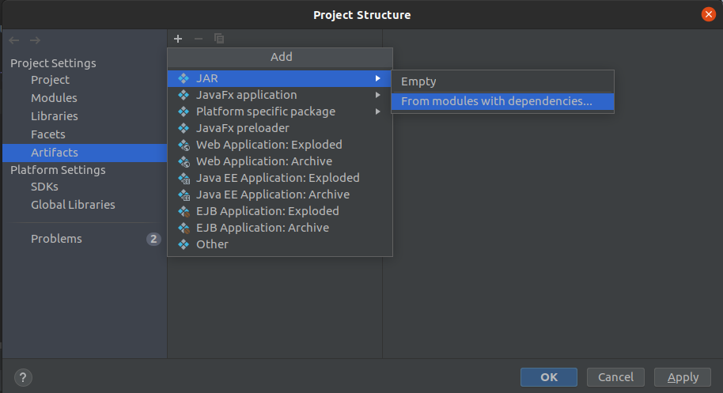
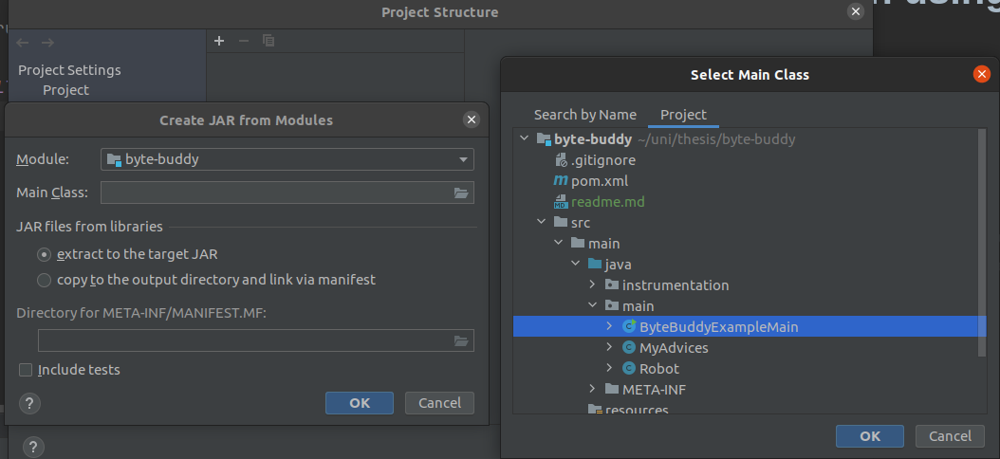
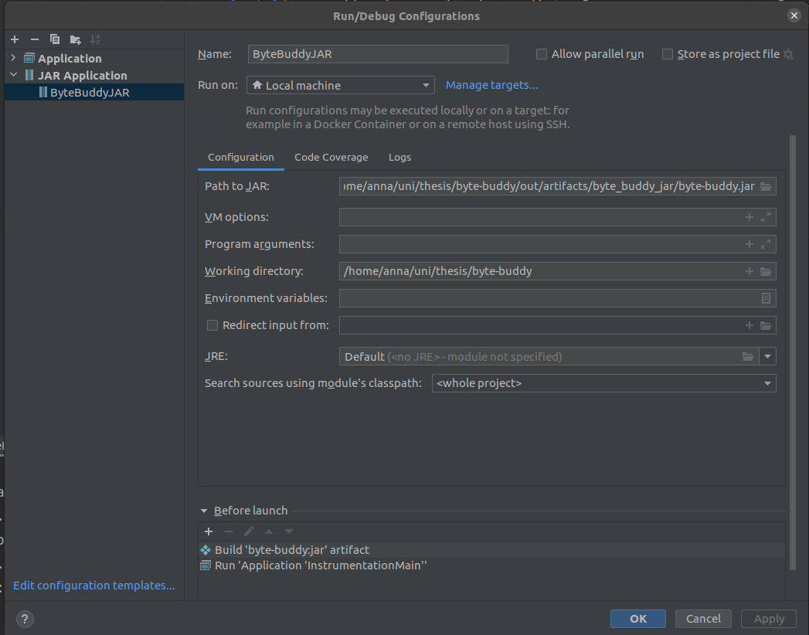

# A simple example of static instrumentation using ByteBuddy inject method
Based on example from [this](https://medium.com/@lnishada/introduction-to-byte-buddy-advice-annotations-48ac7dae6a94) tutorial.

## Structure
* `main` package - containing the application code we want to instrument
* `instrumentation` package - containing code performing the actual instrumentation

## IntelliJ configuration
* in `Project Structure`:
  

  
  
  
* in menu choose Build -> Build Artifacts - it should generate an `out' directory with your JAR
* in `Edit Configurations`:
  * before going to `Edit configurations` run InstrumentationMain to create an IntelliJ configuration
  * then go to `Edit configurations` and add new configuration for `JAR application`
  * in `Before launch` add `Build Artifacts` and `Run Another Configuration` for InstrumentationMain
  * make sure it looks like the following:
    
    
    
    

  
